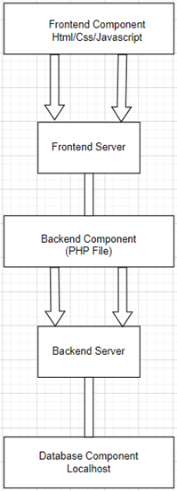
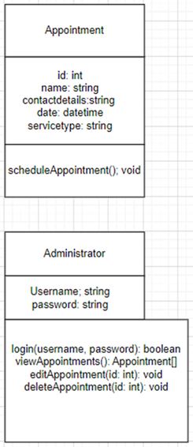
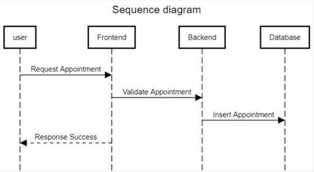
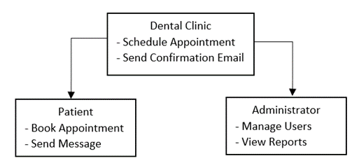

# SE_Project_Phase3_TeamX
Software Design and Modeling Team Name: Dental Clinic Management System (DCMS)

# *System Architecture:*
1. **Frontend (HTML/CSS/JavaScript)**:
   - **Home Page**: This is the only page visible to users. It displays information about the dental clinic, including prices for various services. Users can also schedule appointments from this page.
   - **Appointment Form**: Users can fill out a form on the home page to schedule appointments. The form collects relevant information such as name, contact details, preferred date, and service type.

2. **Backend (PHP)**:
   - **Server-side Processing**: PHP is used to handle server-side processing of appointment requests submitted through the form on the home page.
   - **Database Interaction**: PHP interacts with the local database to store appointment details. When a user submits an appointment request, PHP validates the input data and then inserts it into the database.

3. **Database (Localhost)**:
   - **Appointment Table**: The database contains a table to store appointment details, such as appointment ID, patient name, contact details, preferred date, and service type.
   - **Administrator Table**: Additionally, there might be a table to store administrator credentials, including username and password.

4. **Admin Area**:
   - **Login Page**: This page requires authentication before accessing the admin area. The login credentials are hardcoded as "admin" for both the username and password.
   - **Admin Dashboard**: Once authenticated, the administrator can view a dashboard that displays a list of appointments scheduled at the dental clinic.
   - **Appointment Management**: The administrator can edit or delete appointments from the admin dashboard. These actions involve updating or removing records from the database based on user input.

5. **Security**:
   - **Authentication**: The admin area requires authentication to prevent unauthorized access. This is achieved using hardcoded credentials ("admin/admin" in this case), but in a real-world scenario, more secure authentication mechanisms like hashing passwords and using session management would be employed.
   - **Input Validation**: Both on the frontend (using JavaScript) and backend (using PHP), input validation should be implemented to prevent injection attacks and ensure data integrity.

6. **Deployment**:
   - The website, along with its backend and database, can be deployed locally for testing and development purposes. For production deployment, considerations such as server setup, domain registration, and security configurations would need to be addressed.

   # *Detailed Design*

   ## Component Diagram - This setup enables the flow of data and functionality from the user interface to the backend database.
   

   ## Class Diagram
   

   ## Sequence Diagram
   

   # *Modeling*

   ## Use Case Diagram
   

   ## Activity Diagram
   
